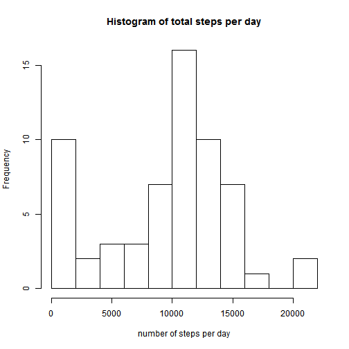
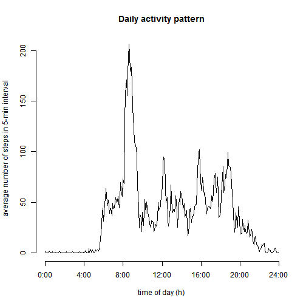
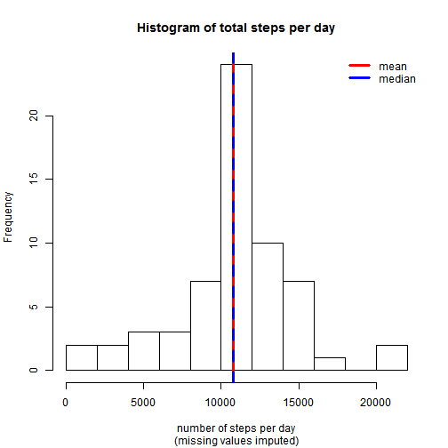
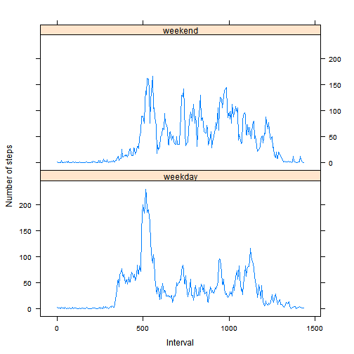

## Introduction

It is now possible to collect a large amount of data about personal movement using activity monitoring devices such as a Fitbit, Nike Fuelband, or Jawbone Up. These type of devices are part of the "quantified self" movement - a group of enthusiasts who take measurements about themselves regularly to improve their health, to find patterns in their behavior, or because they are tech geeks. But these data remain under-utilized both because the raw data are hard to obtain and there is a lack of statistical methods and software for processing and interpreting the data.

## Loading and preprocessing the data


```r
data <- read.csv(unz("repdata-data-activity.zip", "activity.csv"), colClasses=c("integer", "Date", "integer"))
data$interval <- 60*floor((data$interval+1)/100) + (data$interval %% 100)
total_steps <- tapply(data$steps, data$date, sum, na.rm=T)
step_mean <- mean(total_steps)
step_median <- median(total_steps)
```

## What is mean total number of steps taken per day?


```r
step_mean
```

```
## [1] 9354.23
```
### histogram of the total number of steps taken each day


```r
hist(total_steps, breaks=11, 
     xlab="number of steps per day", 
     main="Histogram of total steps per day")
```

 


### Median


```r
step_median
```

```
## [1] 10395
```
### What is the average daily activity pattern?


```r
avg_steps <- tapply(data$steps, data$interval, mean, na.rm=T)

hours <- as.numeric(names(avg_steps))/60
plot(hours, avg_steps, type="l", axes=F,
     xlab="time of day (h)", ylab="average number of steps in 5-min interval",
     main="Daily activity pattern")
axis(2)
axis(1, at=0:6*4, labels=paste(0:6*4,":00", sep=""))
```

 

### Which 5-minute interval, on average across all the days in the dataset, contains the maximum number of steps?


```r
max_act_num <- which(avg_steps==max(avg_steps))
max_act_int <- data$interval[max_act_num]
sprintf("%02d:%02d", floor(max_act_int/60), max_act_int %% 60)
```

```
## [1] "08:35"
```
### Imputing missing values
#### Missing values


```r
sum(is.na(data))
```

```
## [1] 2304
```
#### Changing missing values with average steps


```r
impute_data <- transform(data, steps=ifelse(is.na(steps), avg_steps, steps))
```
#### histogram of the total number of steps taken each day with imputed data 


```r
total_impsteps <- tapply(impute_data$steps, impute_data$date, sum, na.rm=T)

impstep_mean <- mean(total_impsteps)
impstep_median <- median(total_impsteps)
hist(total_impsteps, breaks=11, 
     xlab="number of steps per day", 
     sub="(missing values imputed)",
     main="Histogram of total steps per day")
abline(v=impstep_mean, col="red", lwd=3)
abline(v=impstep_median, col="blue", lwd=3, lty=2)
legend(x="topright", legend=c("mean","median"), col=c("red","blue"), bty="n", lwd=3)
```

 

#### New Mean


```r
impstep_mean 
```

```
## [1] 10766.19
```

#### New Median


```r
impstep_median 
```

```
## [1] 10766.19
```

### Are there differences in activity patterns between weekdays and weekends?


```r
library(plyr)
```

```
## Warning: package 'plyr' was built under R version 3.1.2
```

```r
Sys.setlocale("LC_TIME", "English") 
```

```
## [1] "English_United States.1252"
```

```r
impute_data$weekdays <- weekdays(as.Date(impute_data$date))
impute_data$weekdays <- ifelse(impute_data$weekdays %in% c("Saturday", "Sunday"),"weekend", "weekday")
#average <- ddply(impute_data, .(interval, weekdays), summarise, steps=mean(steps))
average <- ddply(impute_data, .(interval, weekdays),  summarise, steps=mean(steps))
library(lattice)
xyplot(steps ~ interval | weekdays, data = average, layout = c(1, 2), type="l", xlab = "Interval", ylab = "Number of steps")
```

 


